<div align="center">

# crash-whatif — Crash Severity Models with Counterfactual Explanations

**crash-whatif is an explainability study for crash-severity classifiers. It takes a crash table through these steps to a model comparison, a ranking of causes and "what if" counterfactuals:**

`validate` → `split first` → `fit pipelines` → `evaluate on real rows` → `audit the signal` → `rank columns` → `generate counterfactuals`.


**[Summary](#1-summary)** ·
**[Workflow](#4-the-end-to-end-workflow)** ·
**[Run it](#13-how-to-run-crash-whatif)** ·
**[Configuration](#134-environment-variables)** ·
**[Known problems](#16-known-problems)** ·
**[Glossary](#18-glossary)**

</div>

> [!NOTE]
> This README uses ASD-STE100 Simplified Technical English. The writing rules and the project
> vocabulary are in [`docs/ste-style-guide.md`](docs/ste-style-guide.md). Each term in the
> [Glossary](#18-glossary) has only one meaning.

> [!WARNING]
> Do not use crash-whatif to make road-safety, insurance or legal decisions. A counterfactual explains the model, not the real cause of a crash.
> The default data is synthetic. A human expert must review each conclusion.

---

crash-whatif predicts if a crash is severe from vehicle, road and driver columns, and then explains the prediction.
The global explanation is permutation importance with repeats and a seed.
The local explanation is a set of counterfactuals: small, permitted changes to the actionable columns that make the model predict "not severe".
The main idea is a synthetic generator with a KNOWN cause structure, so the tests can check that the explanations find the true causes.
All preprocessing and resampling are steps of one pipeline that sees only the training rows.

This README is the **one location that explains all of crash-whatif**. It gives these topics:

- the general design
- each component and its procedure, step by step
- the decision rules
- the data map
- the runbook
- the validation results and the known problems

| If you are… | Read |
|---|---|
| A manager or reviewer | [1](#1-summary), [3](#3-design-rules), [4](#4-the-end-to-end-workflow), [15](#15-validation-results), [17](#17-key-points) |
| A developer who joins the project | All sections, in sequence. Keep [13](#13-how-to-run-crash-whatif) and [16](#16-known-problems) open while you work |
| An operator who runs crash-whatif | [13](#13-how-to-run-crash-whatif), then the section for the component that you use |

---

## Table of contents

1. 🧭 [Summary](#1-summary)
2. 🏗️ [How crash-whatif is built](#2-how-crash-whatif-is-built)
   - 2.1 [Components](#21-components)
   - 2.2 [System context](#22-system-context)
   - 2.3 [Repository layout](#23-repository-layout)
3. 🛡️ [Design rules](#3-design-rules)
4. 🔄 [The end-to-end workflow](#4-the-end-to-end-workflow)
   - 4.1 [Full flow](#41-full-flow)
   - 4.2 [The life cycle of one query](#42-the-life-cycle-of-one-query)
   - 4.3 [Who does which step](#43-who-does-which-step)
5. 📋 [The crash schema](#5-the-crash-schema)
6. 🧪 [The synthetic generator](#6-the-synthetic-generator)
7. 🔵 [The model pipelines](#7-the-model-pipelines)
8. 🟢 [Evaluation and the signal audit](#8-evaluation-and-the-signal-audit)
9. 🟣 [Permutation importance](#9-permutation-importance)
10. 🔁 [Counterfactuals](#10-counterfactuals)
11. ⚖️ [The counterfactual metrics](#11-the-counterfactual-metrics)
12. 🗂️ [Data and file map](#12-data-and-file-map)
13. ▶️ [How to run crash-whatif](#13-how-to-run-crash-whatif)
    - 13.1 [Prerequisites](#131-prerequisites) · 13.2 [Installation](#132-installation) · 13.3 [Run crash-whatif](#133-run-crash-whatif) · 13.4 [Environment variables](#134-environment-variables)
14. 🧩 [How to extend crash-whatif](#14-how-to-extend-crash-whatif)
15. ✅ [Validation results](#15-validation-results)
16. ⚠️ [Known problems](#16-known-problems)
17. 📌 [Key points](#17-key-points)
18. 📖 [Glossary](#18-glossary)
19. 📄 [License](#19-license)

---

## 1. Summary

**The problem.** A severity classifier is easy to train, but its explanation is easy to get wrong. These questions are difficult:

- Does the test score come from real rows, or from rows that resampling made from test neighbours?
- Does the model learn a cause, or a defect of the data generator?
- Is an importance bar a real effect, or the noise of one shuffle?
- Which small and permitted change makes the model predict "not severe"?
- Does one example tell how good the counterfactuals of a model are?

crash-whatif gives each of these questions its own component. Each component has a test.

| Item | Value |
|---|---|
| Input | A crash table: the public synthetic file, the synthetic generator or a table with the same columns |
| Output | A metrics table, a signal audit, importance tables, a counterfactual benchmark and a Markdown and JSON report |
| Models | `logreg`, `linear_svm`, `random_forest`, `gradient_boosting`, plus the baselines `majority` and `make_only` |
| Counterfactual generators | `RandomSearchCF` (core) and `DiceCF` (extra `dice`) |
| Offline mode | All commands. The synthetic generator replaces the download |
| Safety | Counterfactuals change only actionable columns, inside the training ranges |
| Tests | **41** unit tests (`pytest`), 3 more skip without the optional extras |

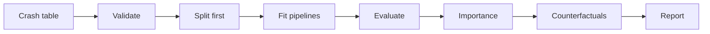

---

## 2. How crash-whatif is built

### 2.1 Components

| Component | Module | Purpose |
|---|---|---|
| Settings | `src/crash_whatif/config.py` | Environment variables, `.env` loader, default actionable columns |
| Crash schema | `src/crash_whatif/schema.py` | Column names, flag mapping, category clean-up, targets |
| Synthetic generator | `src/crash_whatif/synthetic.py` | Seeded crashes with a known cause structure or the make rule |
| Split | `src/crash_whatif/split.py` | Stratified, seeded train, validation and test parts |
| Model pipelines | `src/crash_whatif/models.py` | Imputer, optional resampler, encoder, classifier, threshold |
| Evaluation | `src/crash_whatif/evaluate.py` | ROC AUC with bootstrap interval, PR AUC, F1, Brier, ECE, three-class report |
| Importance | `src/crash_whatif/importance.py` | Drop of ROC AUC for each shuffled input column |
| Counterfactuals | `src/crash_whatif/counterfactuals.py` | `FeatureSpace` and `RandomSearchCF` |
| DiCE adapter | `src/crash_whatif/dice_adapter.py` | `DiceCF` with the same interface (extra `dice`) |
| Counterfactual metrics | `src/crash_whatif/cf_metrics.py` | Validity, proximity, sparsity, diversity, plausibility, summary |
| Study | `src/crash_whatif/study.py` | Prepare, fit, metrics, audit, importance, benchmark |
| Report | `src/crash_whatif/report.py` | Text tables, `report.md` and `report.json` |
| CLI | `src/crash_whatif/cli.py` | The `crash-whatif` command with 9 subcommands |

The component map shows which module calls which module. An arrow points from the caller to the module that it uses.

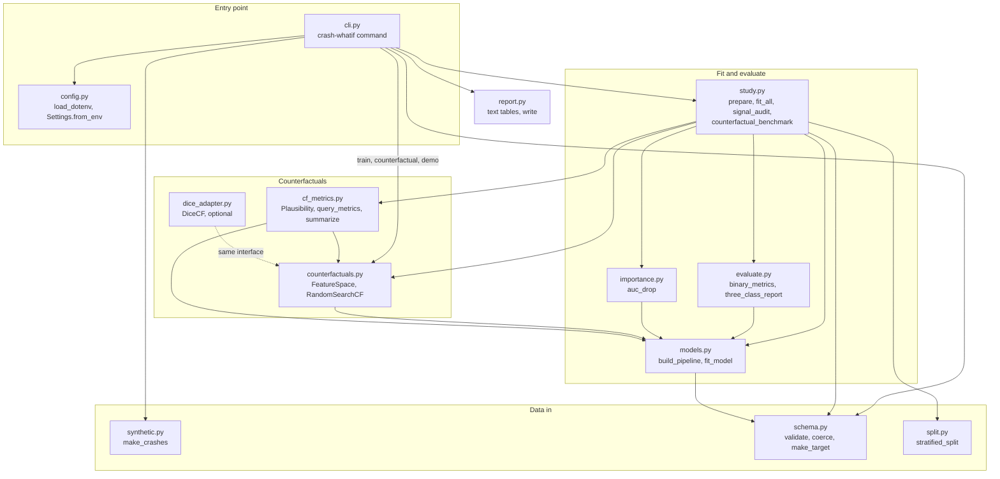

### 2.2 System context

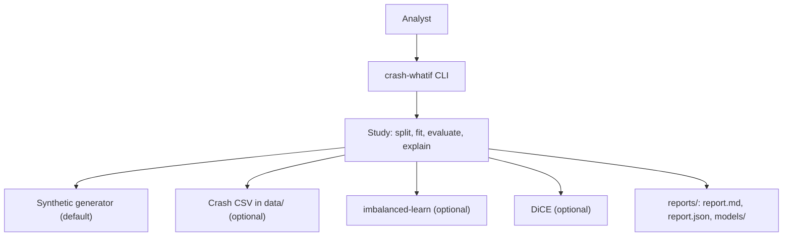

### 2.3 Repository layout

```
crash-whatif/
├── .github/workflows/ci.yml     # CI: Python 3.11, pip install -e ".[dev]", pytest -q
├── .env.example                 # every environment variable, all values empty
├── pyproject.toml               # package, extras (imbalance, dice, dev), crash-whatif script
├── data/README.md               # sources, terms and columns (git ignores the data files)
├── docs/ste-style-guide.md      # writing rules and project vocabulary
├── src/crash_whatif/
│   ├── config.py  schema.py  synthetic.py  split.py
│   ├── models.py  evaluate.py                 # pipelines, thresholds and metrics
│   ├── importance.py                          # permutation importance
│   ├── counterfactuals.py  dice_adapter.py    # generators
│   ├── cf_metrics.py                          # counterfactual metrics
│   ├── study.py  report.py  cli.py            # procedure, report, command line
└── tests/                                     # 44 tests (41 run without extras), no network
```

---

## 3. Design rules

### 3.1 Split first
`study.prepare` validates the table and then splits it into train (60 %), validation (20 %) and test (20 %), stratified by severity. No step before the split learns from the data. The test part is never resampled, so each test row is a real row.

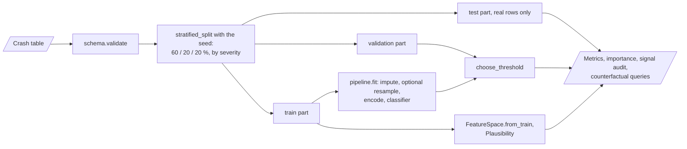

### 3.2 All fit steps are pipeline steps
The imputer, the optional resampler, the encoder, the scaler and the classifier are steps of one pipeline. `fit` gets only the training part. The resampler runs only in `fit`, so it never adds rows to the validation or test part.

### 3.3 A nominal column is never a number
Nominal columns are one-hot encoded. `SMOTENC` treats them as categories. Thus no row gets a fractional category such as `make = 2.37`.

### 3.4 Each flag has its own source
`to_flag` maps `True`, `1`, `1.0` and `yes` to 1 and `False`, `0`, `0.0` and `no` to 0. Each flag reads only its own source column. A test checks that `tcs` is not a copy of `abs`.

### 3.5 An explanation must find the known causes
The synthetic generator has a documented log-odds model and a list of columns with no effect. The tests check that the top columns of the importance table are true causes and that the noise columns get a drop near 0.

### 3.6 The data defect is measured, not hidden
The signal audit compares a model on `make` alone with a model on all other columns. On data where the make decides the label, the audit sets `make_dominates` to `true`.

### 3.7 Counterfactuals are judged over many rows
The benchmark generates counterfactuals for N real test rows for each model. It reports the mean and a bootstrap interval of five metrics, not one example.

---

## 4. The end-to-end workflow

### 4.1 Full flow

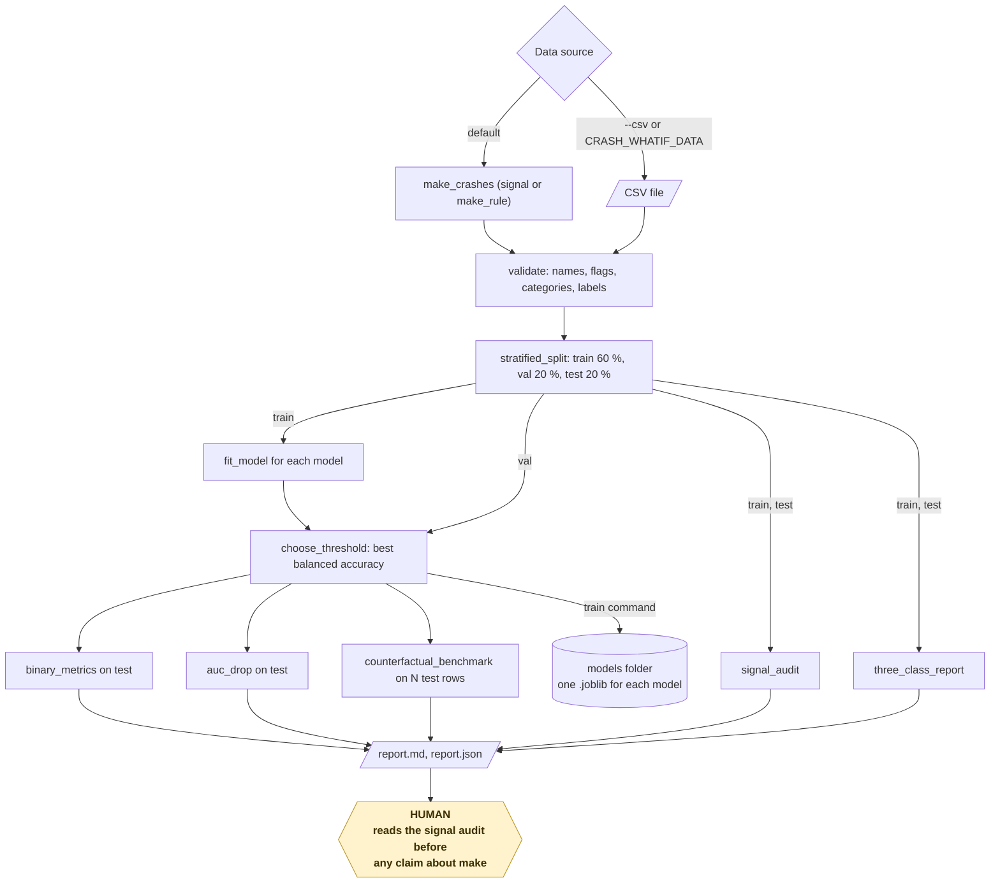

### 4.2 The life cycle of one query

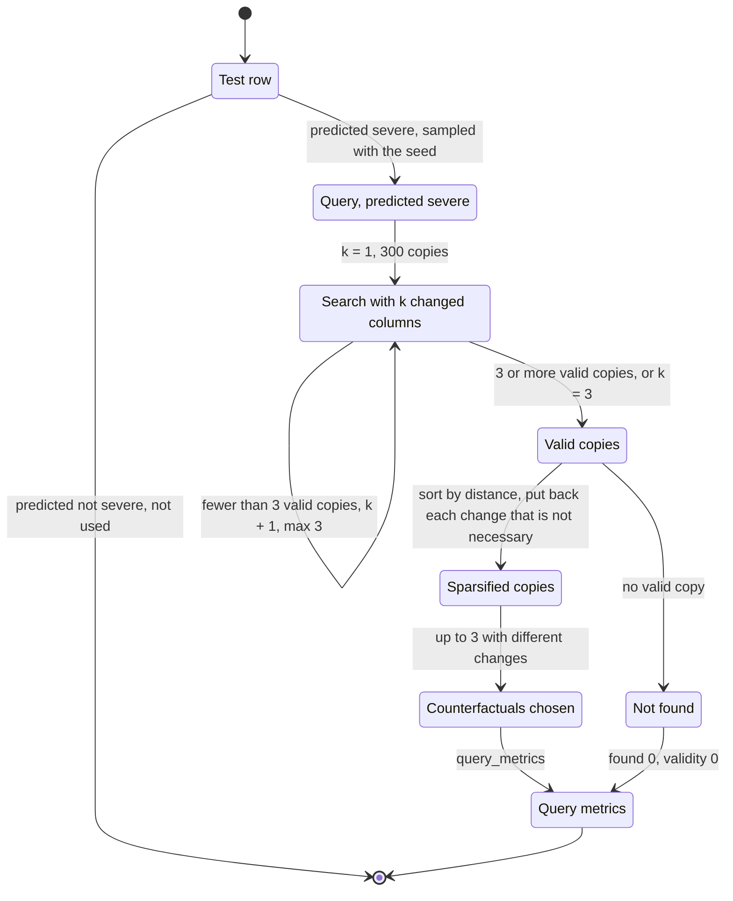

1. The benchmark selects a test row that the model predicts as severe.
2. `RandomSearchCF` makes 300 copies and changes 1 random actionable column in each copy.
3. The model predicts each copy. The copies with "not severe" are valid.
4. If fewer than 3 copies are valid, the search changes 2 columns, then 3 columns.
5. The search sorts the valid copies by distance and puts back each change that is not necessary.
6. The search keeps 3 counterfactuals with different changes.
7. `query_metrics` calculates the five metrics for the query.

### 4.3 Who does which step

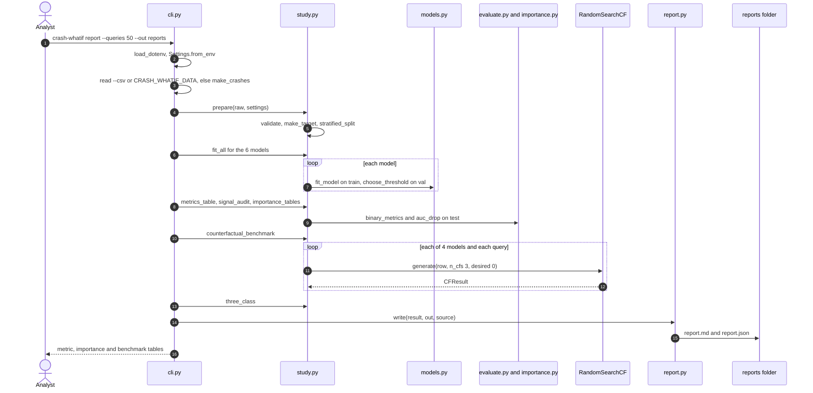

---

## 5. The crash schema

**Purpose.** Accept the public column names, clean each column and give one target.

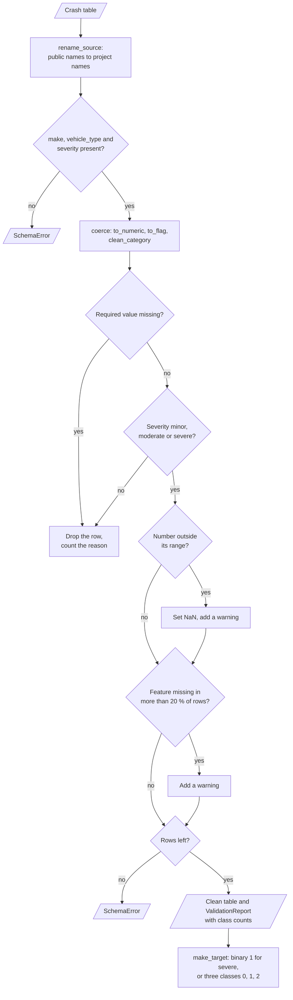

**Procedure**

1. Rename the public columns to project columns, for example `ABS_presence` to `abs`.
2. Stop with `SchemaError` if `make`, `vehicle_type` or `severity` is absent.
3. Coerce the numbers, map the flags with `to_flag` and clean the categories with `clean_category`.
4. Drop rows with a missing required value or an unknown severity.
5. Set a number outside its range to NaN and record a warning.
6. Record a warning for each feature column that is missing in more than 20 % of rows.

**Rules**

| Column group | Columns | Clean-up |
|---|---|---|
| Numbers | `vehicle_year`, `engine_cc`, `cylinders`, `weight_kg`, `length_mm`, `width_mm`, `height_mm`, `safety_rating`, `airbags`, `driver_age` | `to_numeric`, range check |
| Flags | `abs`, `esc`, `tcs`, `tpms` | `to_flag`: 1.0, 0.0 or NaN |
| Nominal | `make`, `vehicle_type`, `engine_type`, `transmission`, `location`, `weather`, `road_surface`, `time_of_day`, `day_of_week`, `driver_gender` | Strip, lower case, `_` for spaces, `'nan'` and blank to NaN |

| Target mode | Value 1 or classes | Use |
|---|---|---|
| `binary` | 1 = `severe`, 0 = `moderate` or `minor` | Models, importance, counterfactuals |
| `three` | 0 = `minor`, 1 = `moderate`, 2 = `severe` | Three-class report with the recall of each class |

---

## 6. The synthetic generator

**Purpose.** Give a crash table where the true causes are known.

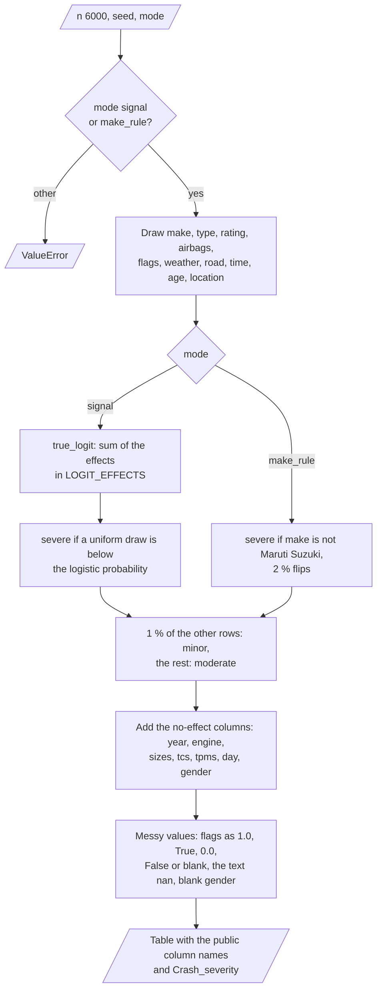

**Procedure (`signal` mode)**

1. Draw the vehicle, road, time and driver columns with a seeded generator.
2. Calculate the log-odds with the effects in the table below.
3. Draw `severe` with the logistic probability. Mark 1 % of the other rows as `minor`.
4. Write the flags as `'1.0'`, `'True'`, `'0.0'`, `'False'` or blank, and add the text `'nan'` to some categories.

| Column | Effect on the log-odds of a severe crash |
|---|---|
| Intercept | +0.9 |
| `make` | −0.5 Maruti Suzuki, −0.2 Honda, 0 Hyundai, +0.3 Mahindra, +0.2 Tata Motors |
| `vehicle_type` | +0.5 for `pickup` |
| `safety_rating` | −0.45 for each step above 2.5 |
| `airbags` | −0.18 for each airbag above 4 |
| `esc`, `abs` | −0.8 and −0.4 if present |
| `weather` | +0.3 rain, +0.7 fog |
| `road_surface` | +0.5 wet, +0.8 muddy |
| `time_of_day` | +0.6 at night |
| `driver_age` | +0.03 for each year away from 45 |
| `location` | +0.4 rural |
| `tcs`, `tpms`, `driver_gender`, `day_of_week`, `transmission`, sizes, weight, engine, year | No effect |

**Rules**

- In `make_rule` mode, the label is `severe` for each make except Maruti Suzuki, with 2 % flips. This copies the defect of the public file.
- The generator never uses the built-in `hash()`. The same seed gives the same table.

---

## 7. The model pipelines

**Purpose.** Fit each model with the same preprocessing on the training rows only.

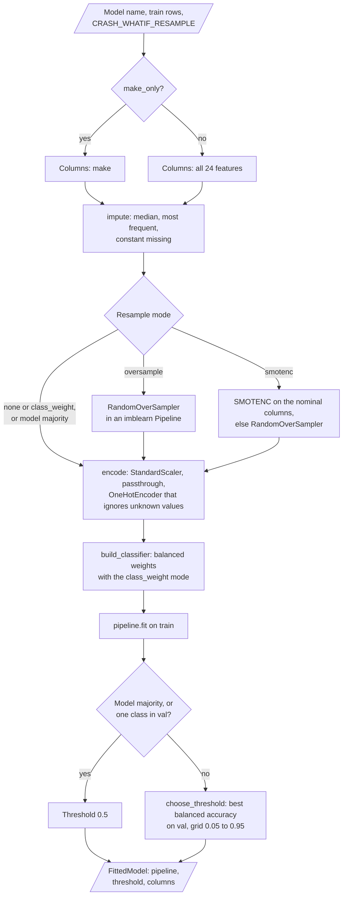

| Step | Object | Notes |
|---|---|---|
| `impute` | `SimpleImputer`: median (numbers), most frequent (flags), `"missing"` (nominal) | pandas output, so the resampler sees column names |
| `resample` | `SMOTENC` or `RandomOverSampler` | Only with `CRASH_WHATIF_RESAMPLE=smotenc` or `oversample` (extra `imbalance`) |
| `encode` | `StandardScaler` (numbers), passthrough (flags), `OneHotEncoder(handle_unknown="ignore")` (nominal) | Fit on train |
| `model` | See the next table | `class_weight="balanced"` with the default `class_weight` mode |

| Model | Classifier |
|---|---|
| `majority` | `DummyClassifier(strategy="prior")` |
| `make_only` | `LogisticRegression` on `make` only |
| `logreg` | `LogisticRegression(max_iter=2000)` |
| `linear_svm` | `LinearSVC(C=0.5)` in `CalibratedClassifierCV(cv=3, method="sigmoid")` |
| `random_forest` | `RandomForestClassifier(n_estimators=200, min_samples_leaf=3)` |
| `gradient_boosting` | `HistGradientBoostingClassifier(max_iter=200, learning_rate=0.08)` |

**Rules**

- `choose_threshold` selects the threshold with the best balanced accuracy on the validation part, on a grid from 0.05 to 0.95.
- `FittedModel.predict` uses this threshold. The counterfactual search uses the same threshold.

---

## 8. Evaluation and the signal audit

**Purpose.** Measure each model on real test rows, and measure how much `make` alone explains.

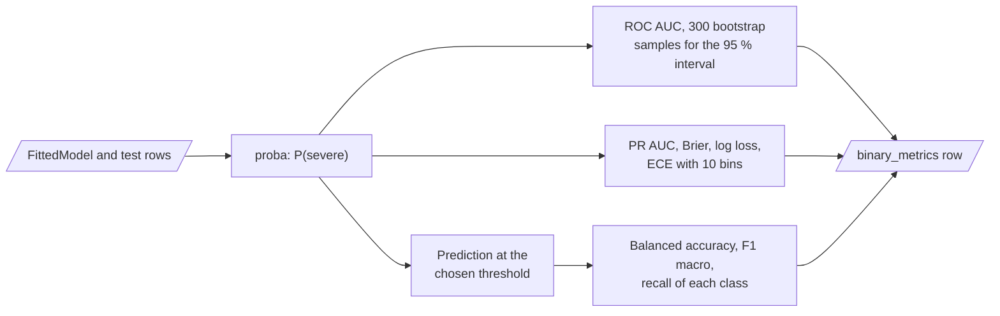

| Metric | Meaning |
|---|---|
| ROC AUC, with a 95 % bootstrap interval | Ranking quality, 300 bootstrap samples |
| PR AUC (severe) | Average precision for the severe class |
| Balanced accuracy, F1 macro, recall of each class | Quality at the chosen threshold |
| Brier score, log loss, ECE | Probability quality. ECE uses 10 equal-width bins |

**Procedure of the signal audit**

1. Fit a logistic pipeline on `make` only, and calculate the test ROC AUC.
2. Fit a logistic pipeline on all columns except `make`, and calculate the test ROC AUC.
3. Fit a logistic pipeline on all columns.
4. Set `make_dominates` to `true` if the AUC of `make` alone is above 0.9 and the AUC without `make` is below 0.6.

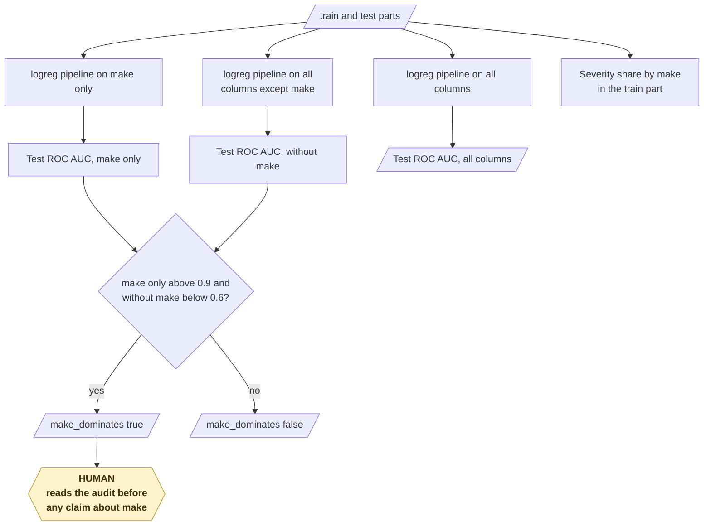

---

## 9. Permutation importance

**Purpose.** Rank the input columns by how much the model uses them.

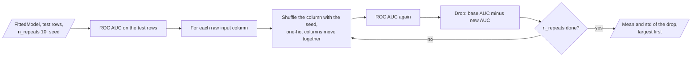

**Procedure**

1. Calculate the ROC AUC of the model on the test part.
2. Shuffle one input column with a seeded generator. All one-hot columns of a nominal column move together.
3. Calculate the ROC AUC again. The drop is the importance of the column.
4. Do steps 2 and 3 `n_repeats` times (default 10). Report the mean and the standard deviation.

**Rules**

- A positive drop means that the model uses the column. A drop near 0 means that it does not.
- The table is not used to select features, so the test part does not change the model.

---

## 10. Counterfactuals

**Purpose.** Find small, permitted changes that make the model predict "not severe".

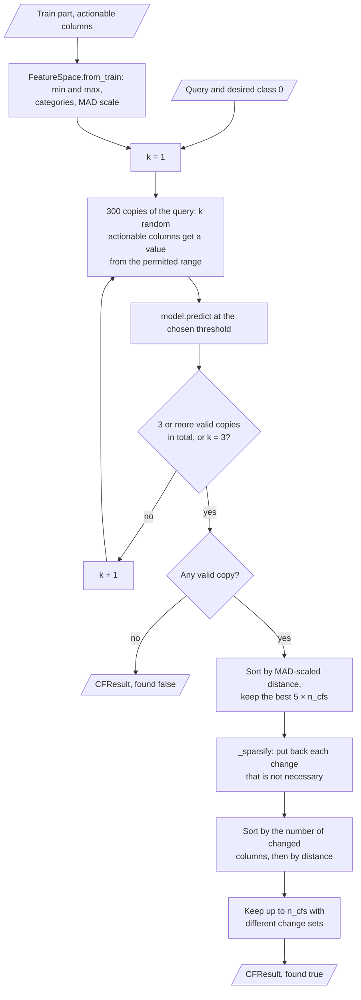

| Input | Output |
|---|---|
| A fitted model, a `FeatureSpace`, a query, `n_cfs` | A `CFResult` with up to `n_cfs` counterfactuals and a `found` flag |

**Rules**

| Rule | Value |
|---|---|
| Actionable columns (default) | `abs`, `esc`, `tcs`, `tpms`, `airbags`, `safety_rating`, `vehicle_type`, `transmission`, `time_of_day` |
| Fixed columns | All other columns, for example driver age and gender, weather and road surface |
| Permitted range | Training minimum and maximum (numbers), training categories (nominal) |
| Copies for each step | 300 |
| Maximum changed columns | 3 |
| Integer columns | New values are integers |
| Distance | Sum of \|change\| / MAD for numbers, plus 1 for each changed nominal column |

`DiceCF` gives the same result type with the DiCE `random` method. DiCE uses the threshold 0.5 of the pipeline, not the chosen threshold.

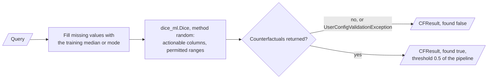

---

## 11. The counterfactual metrics

The diagram shows how `counterfactual_benchmark` calculates the metrics for each model.

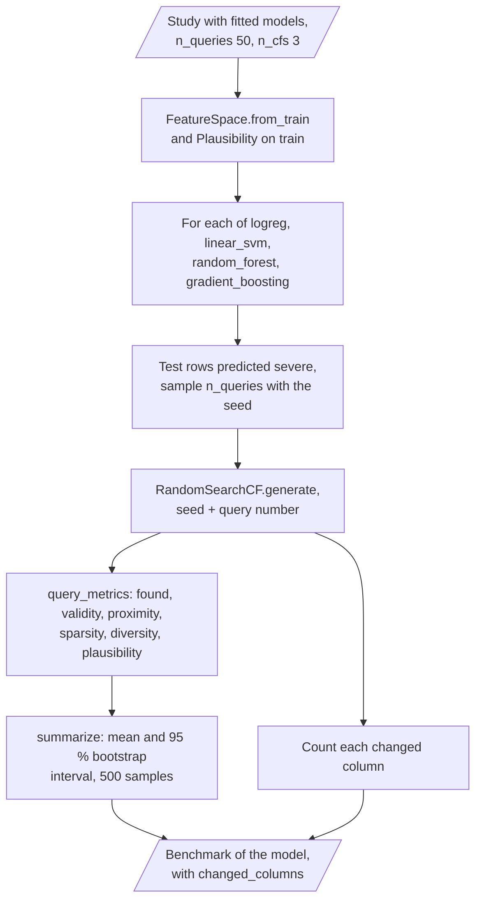

| Metric | Calculation | Better |
|---|---|---|
| `found` | 1 if the search found at least one counterfactual | Higher |
| `validity` | Share of counterfactuals that the model predicts as not severe | Higher |
| `proximity` | Mean MAD-scaled distance from the query | Lower |
| `sparsity` | Mean number of changed columns | Lower |
| `diversity` | Mean distance between the counterfactuals of one query | Higher |
| `plausibility` | Distance to the nearest training row ÷ median nearest-neighbour distance between training rows | Near 1 or lower |

The benchmark reports the mean and a 95 % bootstrap interval of each metric over the queries, and counts how often each column changed.

---

## 12. Data and file map

| Path | Committed? | Contents |
|---|---|---|
| `data/README.md` | Yes | Sources, terms and columns |
| `data/*.csv` | No (git ignores it) | Synthetic or downloaded crash tables |
| `reports/report.md`, `reports/report.json` | No (git ignores it) | The output of `crash-whatif report` |
| `reports/models/<model>.joblib` | No (git ignores it) | Fitted model, threshold and feature space from `train` |
| `.env` | No (git ignores it) | Local settings |
| `.env.example` | Yes | All variable names, no values |

---

## 13. How to run crash-whatif

### 13.1 Prerequisites

| Need | For |
|---|---|
| Python 3.11+ | All components |
| `numpy`, `pandas`, `scikit-learn>=1.4` | Core (installed with the package) |
| `imbalanced-learn` (extra `imbalance`) | `CRASH_WHATIF_RESAMPLE=smotenc` or `oversample` |
| `dice-ml` (extra `dice`) | `DiceCF` |

### 13.2 Installation

```bash
git clone https://github.com/KrishnaAnnavaram/crash-whatif.git
cd crash-whatif
python -m venv .venv
. .venv/bin/activate            # Windows: .venv\Scripts\activate
pip install -e ".[dev]"         # add ,imbalance,dice for the optional parts
```

### 13.3 Run crash-whatif

Offline (no key, no network):

```bash
crash-whatif demo                                   # metrics, audit, importance, benchmark, one example
crash-whatif generate --out data/crashes.csv --rows 6000
crash-whatif validate --csv data/crashes.csv
crash-whatif train --csv data/crashes.csv --out reports
crash-whatif counterfactual --model reports/models/random_forest.joblib --input crash.json
crash-whatif explain --models logreg,random_forest --repeats 10
crash-whatif audit --mode make_rule                  # shows the make-rule defect
crash-whatif whatif --queries 100 --json
crash-whatif report --queries 50 --out reports
```

With the public file and the optional extras:

```bash
crash-whatif audit --csv data/Crash_Data.csv
CRASH_WHATIF_RESAMPLE=smotenc crash-whatif report --csv data/Crash_Data.csv
```

| Command | What it does |
|---|---|
| `demo` | Runs the full study on synthetic data and prints counterfactuals for one example crash |
| `generate` | Writes a synthetic CSV (`--mode signal` or `make_rule`) |
| `validate` | Prints the validation report of a CSV |
| `train` | Fits all models and saves them with the threshold and the feature space |
| `explain` | Prints permutation importance |
| `audit` | Prints the signal audit as JSON |
| `whatif` | Runs the counterfactual benchmark |
| `counterfactual` | Prints counterfactuals for one crash with a saved model |
| `report` | Writes `report.md` and `report.json` with all results. The three-class report is in `report.json` only |

The diagram shows the order of the commands and the files that connect them.

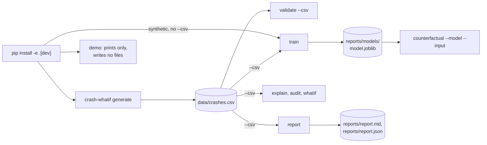

### 13.4 Environment variables

| Variable | Used by | Meaning |
|---|---|---|
| `CRASH_WHATIF_SEED` | All components | Seed of the split, the models, the shuffles and the search. Default 42 |
| `CRASH_WHATIF_DATA` | Data source | CSV path when `--csv` is not given. Empty: synthetic data |
| `CRASH_WHATIF_OUT` | `train`, `report` | Output folder. Default `reports` |
| `CRASH_WHATIF_RESAMPLE` | Pipelines | `class_weight` (default), `none`, `oversample` or `smotenc` |
| `CRASH_WHATIF_TARGET` | Settings | `binary` (default) or `three`. The code checks the value, but no command uses it: the models always use the binary target. The `report` command always adds the three-class report |
| `CRASH_WHATIF_N_QUERIES` | Benchmark | Queries for each model. Default 50 |
| `CRASH_WHATIF_ACTIONABLE` | Counterfactuals | Comma-separated actionable columns. Default: the list in section 10 |

The CLI reads a local `.env` file. A variable that is already in the environment wins. A value that is not valid stops the command with `error:`. crash-whatif needs no credentials.

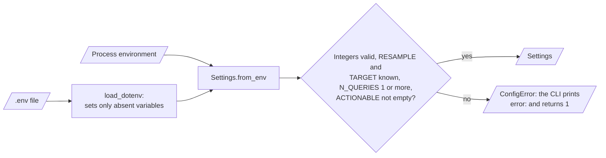

---

## 14. How to extend crash-whatif

| You want to… | Do this | Code change? |
|---|---|---|
| Change the actionable columns | Set `CRASH_WHATIF_ACTIONABLE` | No |
| Use SMOTENC | Install the extra `imbalance` and set `CRASH_WHATIF_RESAMPLE=smotenc` | No |
| Use a real crash dataset | Map its columns in `SOURCE_COLUMNS` and the column lists in `schema.py` | Small |
| Add a model | Add a branch in `build_classifier` and its name in `MODEL_NAMES` | Small |
| Add a counterfactual generator | Make a class with `generate(query, n_cfs, desired, seed)` that returns a `CFResult` | Small |
| Add SHAP values | Add an adapter next to `importance.py` with a lazy import | Yes |

Planned milestones (not built):

- **M6:** a real crash dataset (for example CRSS or STATS19) with its own schema map.
- **M7:** SHAP values for the tree and linear models, compared with permutation importance.
- **M8:** a benchmark of `RandomSearchCF` and `DiceCF` on the same queries.

---

## 15. Validation results

All numbers come from the **synthetic** `signal` data (6,000 rows, seed 42). They are not findings about real crashes.

| Validation | Result | Command |
|---|---|---|
| Unit tests (CI installs only `.[dev]`) | **41 passed**, 3 skipped (extras `imbalance` and `dice` absent) | `pytest -q` |
| Unit tests with the extras | **44 passed** | `pip install -e ".[dev,imbalance,dice]"`, `pytest -q` |
| Test ROC AUC (1,200 rows) | `logreg` 0.722 [0.687, 0.750] · `linear_svm` 0.721 · `random_forest` 0.700 · `gradient_boosting` 0.677 · `make_only` 0.566 · `majority` 0.500 | `crash-whatif report` |
| Probability quality | ECE: `linear_svm` 0.024, `random_forest` 0.083, `logreg` 0.214 (class weights) | `crash-whatif report` |
| Signal audit (signal data) | AUC `make` only 0.566, without `make` 0.714, all columns 0.722, `make_dominates` false | `crash-whatif audit` |
| Signal audit (make-rule data) | AUC `make` only 0.937, without `make` 0.500, all columns 0.933, `make_dominates` true | `crash-whatif audit --mode make_rule` |
| Importance, `logreg` (top 4) | `safety_rating` +0.054, `airbags` +0.039, `esc` +0.039, `road_surface` +0.027 | `crash-whatif report` |
| Importance of no-effect columns | `tcs`, `tpms`, `driver_gender`: below 0.001 in absolute value | `crash-whatif report` |
| Counterfactuals, 50 queries | `random_forest`: found 0.96, sparsity 1.33, proximity 2.38, plausibility 0.98 · `logreg`: found 0.92, sparsity 1.47, proximity 2.55, plausibility 0.99 | `crash-whatif report` |
| Three classes | Recall of `minor` = 0.0 for both models (12 training rows) | `crash-whatif report` |

The importance tables find the true causes of the generator, and the no-effect columns stay near 0. Thus the explanation code works on data with a known answer.
The audit detects the make rule of the public file.
The counterfactuals change mostly `safety_rating`, `airbags`, `esc` and `time_of_day`, which are true causes in the generator.
These numbers do not prove anything about real crashes.
The prototype reported a near-perfect accuracy on the public file (prototype result, not reproduced here). That value came from resampling before the split and from the make rule.

---

## 16. Known problems

Read these problems before you use crash-whatif in production.

| # | Area | Problem | Impact and action |
|---|---|---|---|
| 1 | Data | CI and the demo use only synthetic data. Results on a real crash dataset are not reproduced | Map a real dataset (M6) before you draw a conclusion |
| 2 | Public file | The public Kaggle file is synthetic, and `make` decides its label | Run `crash-whatif audit` first. Do not report "make is the key factor" as a finding |
| 3 | Causality | A counterfactual explains the model, not the world | Do not read a counterfactual as advice to a driver or a car maker |
| 4 | Minor class | `minor` has about 1 % of rows. Its recall is 0.0 in the three-class report | The binary target merges `minor` into "not severe". Collect more minor crashes for a three-class model |
| 5 | Probabilities | Class weights shift the probabilities (`logreg` ECE 0.214) | Use `CRASH_WHATIF_RESAMPLE=none` and a calibrated model when you need probabilities |
| 6 | Search | `RandomSearchCF` changes at most 3 columns. A very severe query can have no counterfactual | `found` reports this. Increase `max_changes` in code for a wider search |
| 7 | DiCE | `DiceCF` uses the threshold 0.5 of the pipeline and fills missing query values with the training median or mode | Compare DiCE results with care. Only a smoke test covers it |
| 8 | Fairness | `driver_gender` and `driver_age` are model inputs. Real crash records can be biased by where and how police record crashes | Keep them fixed in counterfactuals (default), and audit errors by group |

---

## 17. Key points

1. **Split first, fit later.** Each fit step is a pipeline step that sees only the training rows.
2. **The test rows are real.** No resampled or synthetic row is in the test part.
3. **The generator has a known answer.** The tests check that the explanations find the true causes.
4. **The data defect is measured.** The signal audit detects a label that `make` alone decides.
5. **Counterfactuals are judged over many queries.** Five metrics with bootstrap intervals replace one example.
6. **The full study runs offline.** All 41 core tests run with no network and no key.

---

## 18. Glossary

| Term | Meaning |
|---|---|
| **Actionable column** | A column that a counterfactual can change |
| **Baseline** | The `majority` model or the `make_only` model |
| **Counterfactual** | A changed copy of a crash that the model predicts as not severe |
| **ECE** | Expected calibration error: weighted mean gap between predicted and observed rates |
| **Flag** | A 0/1 safety column: `abs`, `esc`, `tcs` or `tpms` |
| **MAD** | Median absolute deviation of a column on the training rows |
| **Permitted range** | The training minimum and maximum of an actionable column |
| **Permutation importance** | The drop of ROC AUC when one input column is shuffled |
| **Pipeline** | Imputer, optional resampler, encoder and classifier as one object |
| **Query** | The crash that a counterfactual explains |
| **Severe crash** | A crash with severity `severe` |
| **Signal audit** | The comparison of `make` alone with the other columns |
| **Threshold** | The probability cut, chosen on the validation part |

---

## 19. License

[MIT](LICENSE) © 2026 Krishna Annavaram
